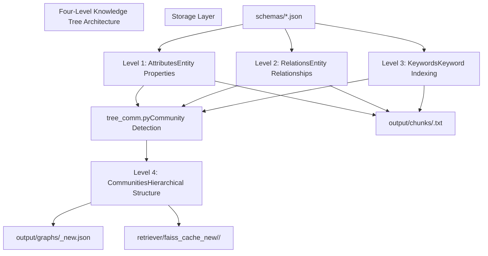
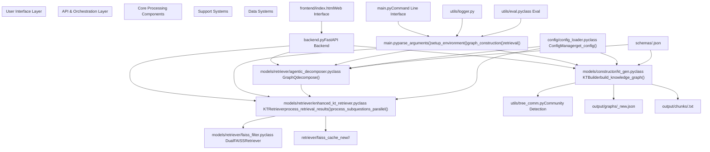
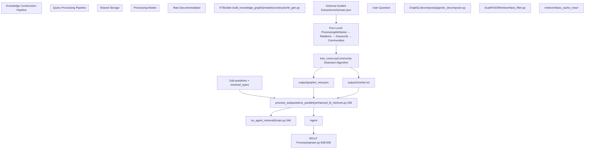

# System Architecture

> **Relevant source files**

> * [README.md](https://github.com/TencentCloudADP/youtu-graphrag/blob/a71105c2/README.md)

> * [main.py](https://github.com/TencentCloudADP/youtu-graphrag/blob/a71105c2/main.py)

This document describes the overall system architecture of Youtu-GraphRAG, covering the core architectural principles, component relationships, data flow patterns, and processing paradigms. For information about specific component implementations, see [Core Components](/TencentCloudADP/youtu-graphrag/4-core-components). For deployment and runtime architecture, see [Deployment Guide](/TencentCloudADP/youtu-graphrag/8-deployment-guide).

## Core Architectural Principles

Youtu-GraphRAG is built on three foundational architectural principles that distinguish it from traditional retrieval-augmented generation systems:

### Vertically Unified Agentic Paradigm

The framework integrates all components through a shared graph schema, enabling seamless coordination between knowledge construction, query decomposition, and retrieval processes. This vertical integration is orchestrated through the `main.py` entry point which coordinates the `KTBuilder`, `GraphQ`, and `KTRetriever` components.

### Schema-Guided Processing

All system components operate using domain-specific schemas located in `schemas/` directory. These schemas guide entity extraction, relationship modeling, and query decomposition, ensuring consistent knowledge representation throughout the pipeline.

### Four-Level Hierarchical Knowledge Tree

The system constructs knowledge graphs with a hierarchical four-level architecture that supports both top-down filtering and bottom-up reasoning:



**Four-Level Knowledge Tree Architecture**

Sources: [README.md L55-L60](https://github.com/TencentCloudADP/youtu-graphrag/blob/a71105c2/README.md#L55-L60)

 [models/constructor/kt_gen.py](https://github.com/TencentCloudADP/youtu-graphrag/blob/a71105c2/models/constructor/kt_gen.py)

 [utils/tree_comm.py](https://github.com/TencentCloudADP/youtu-graphrag/blob/a71105c2/utils/tree_comm.py)

## Component Architecture

The system is organized into distinct layers with clear separation of concerns. Each layer contains specific components that map directly to code entities:



**Component Architecture with Code Entity Mappings**

Sources: [main.py L14-L18](https://github.com/TencentCloudADP/youtu-graphrag/blob/a71105c2/main.py#L14-L18)

 [README.md L118-L156](https://github.com/TencentCloudADP/youtu-graphrag/blob/a71105c2/README.md#L118-L156)

 [models/constructor/kt_gen.py](https://github.com/TencentCloudADP/youtu-graphrag/blob/a71105c2/models/constructor/kt_gen.py)

 [models/retriever/enhanced_kt_retriever.py](https://github.com/TencentCloudADP/youtu-graphrag/blob/a71105c2/models/retriever/enhanced_kt_retriever.py)

 [models/retriever/agentic_decomposer.py](https://github.com/TencentCloudADP/youtu-graphrag/blob/a71105c2/models/retriever/agentic_decomposer.py)

## Data Flow Architecture

The system processes data through two primary pipelines: knowledge graph construction and query processing. Both pipelines share the same schema-guided approach:



**Data Flow Architecture with Function Mappings**

Sources: [main.py L134-L159](https://github.com/TencentCloudADP/youtu-graphrag/blob/a71105c2/main.py#L134-L159)

 [main.py L162-L200](https://github.com/TencentCloudADP/youtu-graphrag/blob/a71105c2/main.py#L162-L200)

 [main.py L202-L343](https://github.com/TencentCloudADP/youtu-graphrag/blob/a71105c2/main.py#L202-L343)

 [main.py L370-L542](https://github.com/TencentCloudADP/youtu-graphrag/blob/a71105c2/main.py#L370-L542)

## Processing Modes Architecture

The system supports two distinct processing modes that determine how queries are handled:

### NoAgent Mode

Sequential processing mode where questions are decomposed into sub-questions and processed in parallel without iterative reasoning:

| Component | Function | Purpose |
| --- | --- | --- |
| `GraphQ` | `decompose()` | Break complex questions into sub-questions |
| `KTRetriever` | `process_subquestions_parallel()` | Parallel processing of sub-questions |
| `KTRetriever` | `generate_answer()` | Single-pass answer generation |

### Agent Mode with IRCoT

Advanced processing mode using Iterative Retrieval Chain of Thought for step-by-step reasoning:

```

```

**IRCoT Processing Mode Architecture**

Sources: [main.py L370-L542](https://github.com/TencentCloudADP/youtu-graphrag/blob/a71105c2/main.py#L370-L542)

 [main.py L408-L506](https://github.com/TencentCloudADP/youtu-graphrag/blob/a71105c2/main.py#L408-L506)

 [config/base_config.yaml](https://github.com/TencentCloudADP/youtu-graphrag/blob/a71105c2/config/base_config.yaml)

## Configuration Architecture

The system uses a centralized configuration management system that supports runtime parameter overrides:

| Configuration Component | File Path | Purpose |
| --- | --- | --- |
| `ConfigManager` | `config/config_loader.py` | Central configuration management |
| `base_config.yaml` | `config/base_config.yaml` | Default system parameters |
| Dataset configs | `get_dataset_config()` | Per-dataset schema and file paths |
| Runtime overrides | `main.py:550-557` | JSON-based parameter overrides |

The configuration system supports multiple trigger modes controlled through `config.triggers`:

* `constructor_trigger`: Enable/disable knowledge graph construction
* `retrieve_trigger`: Enable/disable retrieval and QA processing
* `mode`: Switch between "noagent" and "agent" processing modes

Sources: [main.py L83-L91](https://github.com/TencentCloudADP/youtu-graphrag/blob/a71105c2/main.py#L83-L91)

 [main.py L546-L557](https://github.com/TencentCloudADP/youtu-graphrag/blob/a71105c2/main.py#L546-L557)

 [config/config_loader.py](https://github.com/TencentCloudADP/youtu-graphrag/blob/a71105c2/config/config_loader.py)

 [README.md L98-L104](https://github.com/TencentCloudADP/youtu-graphrag/blob/a71105c2/README.md#L98-L104)